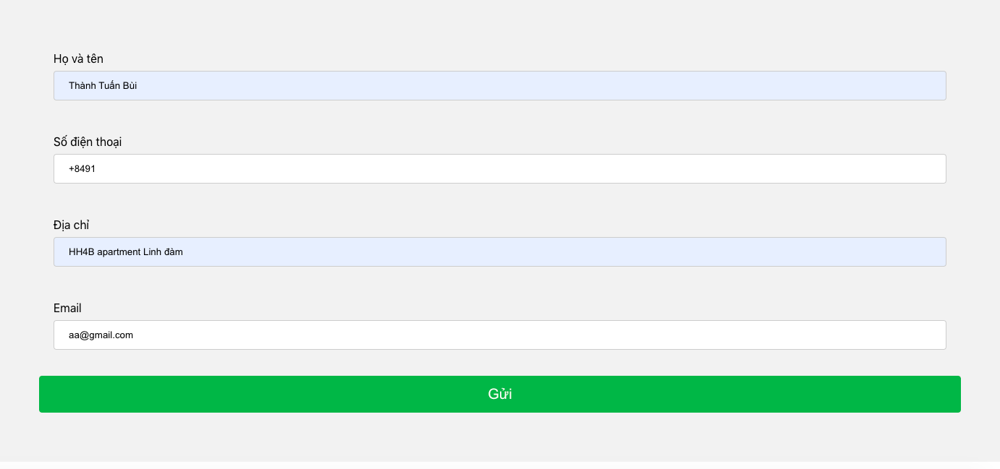

# App

+ Người sử dụng nhập thông tin từ giao diện client, rồi nhấn gửi.

+ Dữ liệu được gửi đến server và lưu tại db.sqlite3 trong server.

+ Sử dụng trang Admin của django để update dữ liệu

# Giao diện client + Admin

## Client

## Admin 

